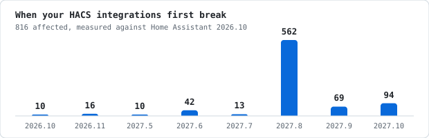

### Christo · `Booyaka101`

Hong Kong. I build guardrails for dependency and toolchain risk, plus local AI pipelines and game tooling.

<picture>
  <source media="(prefers-color-scheme: dark)" srcset="assets/hero-dark.svg">
  
</picture>

<!-- auto:stamp -->
Live figures, rebuilt 2026-08-14.
<!-- /auto:stamp -->

### Tools

**[hass-breakage-radar](https://github.com/Booyaka101/hass-breakage-radar)**. Which of your Home Assistant custom integrations stop working, and in which future release. Crawls every HACS integration daily for deprecated HA APIs, and ships a HACS-installable integration that reports on your own box. [Live dashboard](https://booyaka101.github.io/hass-breakage-radar/).

<!-- auto:radar -->
> Today's crawl checked **3,088** HACS integrations against core 2026.9 and found **1,573** deprecation hits across **625** repos. **2,445** are clean. Next up: **11** break in Home Assistant 2026.10.
<!-- /auto:radar -->

<picture>
  <source media="(prefers-color-scheme: dark)" srcset="assets/breakage-dark.svg">
  
</picture>

**[ts7-compat-guard](https://github.com/Booyaka101/ts7-compat-guard)**. TypeScript 7.0 / tsgo readiness scanner. Compiler-API dependencies and removed tsconfig options with line numbers. Config-only, so no false positives. CLI, GitHub Action, SARIF.

**[npm-script-lens](https://github.com/Booyaka101/npm-script-lens)**. Audit npm lifecycle scripts for behavioural risk before you approve them under npm v12 `allowScripts`. I run it daily against a download-ranked sample of the registry and publish the result as the [npm install-script census](https://github.com/Booyaka101/npm-install-census).

<!-- auto:census -->
> Today's census audited **3,077** packages from the registry: **25** run an install script, **18** score HIGH. Biggest is `esbuild` at 255.5M installs a week.
<!-- /auto:census -->

**[rust-symbol-audit](https://github.com/Booyaka101/rust-symbol-audit)**. Capability-creep triage for Rust dependency PRs. Diffs demangled symbols, inspects `build.rs` and proc-macros, checks provenance and advisories, with a review ratchet you can block merges on.

**[cargo-witness](https://github.com/Booyaka101/cargo-witness)**. Detects Rust supply-chain attacks by diffing published crate artifacts against their git source. CLI, daemon, GitHub Action.

**[palschema-hub](https://github.com/Booyaka101/palschema-hub)**. Community schema registry for Palworld PalSchema raw-table mods. 31 SDK-verified DataTable schemas and a validator CLI.

**[agentscript-nvim](https://github.com/Booyaka101/agentscript-nvim)**. Neovim support for Salesforce Agent Script: filetype, LSP, tree-sitter, fallback syntax.

### Upstream

<!-- auto:upstream -->
When I depend on something and hit a real bug, I send the fix back. **45 merged PRs across 25 projects**, including koreader (2), nvim-lspconfig, gh-dash (2), sqlfluff (6), lualine.nvim, minijinja, this-week-in-rust, aerial.nvim (2), obsidian.nvim (2), soccerdata. 33 more open.
<!-- /auto:upstream -->

[Every PR I've opened](https://github.com/issues?q=author%3ABooyaka101+is%3Apr) · [issues I've filed](https://github.com/issues?q=author%3ABooyaka101+is%3Aissue+-author%3Aapp%2Fgithub-actions)

### Elsewhere

**[The Daily Fable](https://booyaka101.github.io/thedailyfable/)**. One brand-new generative piece every day, made end to end by an AI. So far: typefaces, a fugue under strict counterpoint, a board game, a neural net learning English from one book, and field recordings of a language family that never existed.

<!-- auto:fable -->
> Latest: [Day 18 — ONE WATER (field recordings of a language that never existed)](https://booyaka101.github.io/thedailyfable/day18/) · 2026-08-14 · 18 pieces so far.
<!-- /auto:fable -->

**[comfyui-vlm-gates](https://github.com/Booyaka101/comfyui-vlm-gates)**. Multi-VLM consensus gates and quality scoring for AI image pipelines. Catches bad renders before they ship.

WoW Ascension (3.3.5) addons: **[Scrap](https://github.com/Booyaka101/Scrap)** (auto-sell greys, AdiBags and Bagnon integration) and **[CCTracker](https://github.com/Booyaka101/CCTracker)** (crowd control, silence and interrupt tracker).

Open to work on dependency-security tooling, ComfyUI pipelines, or anything in the Ascension addon ecosystem. cbosch101@gmail.com
